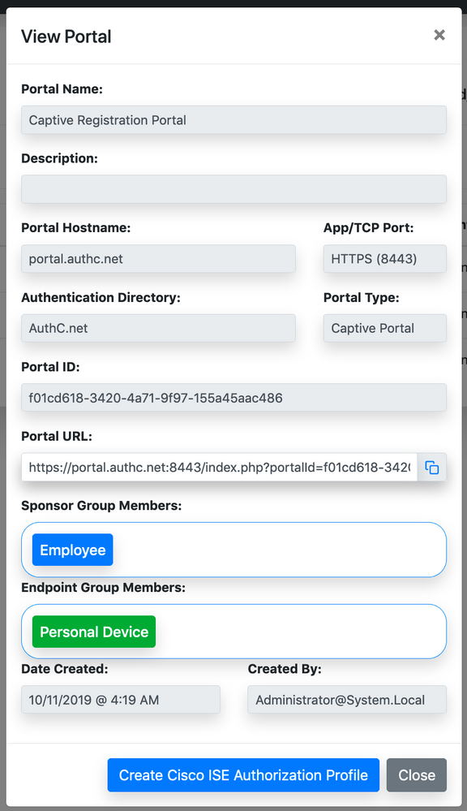

# ISE Configuration

[[README](README.md)] [[WLC Configuration](WLC.md)] 

## ODBC Integration with iPSK Manager

Primary integration between ISE and iPSK Manager is via ODBC to the SQL database. Follow the instructions below to create the ODBC identity store on ISE.

1. Go to Administration > Identity Management > External Identity Sources.
2. On the left-hand side, click on "ODBC".

3. Click "Add".
4. Provide a Name and Description (e.g., "iPSK" for this document).
5. Click on the "Connection" tab and enter the following information:

   | Field name      | Sample entry        | Note                                     |
   |-----------------|---------------------|------------------------------------------|
   | Hostname/IP[port] | 192.168.201.90     |                                          |
   | Database name   | ipsk                | This is the database name used during installation step |
   | Admin username  | ipsk-ise-user       | This is the username created during installation step |
   | Admin password  | e1YV3JefcDQut8g    | This is the password that was created after the installation step via txt file |
   | Database type   | MySQL               |                                          |

6. Click on the "Stored Procedures" tab and enter the following info:

   | Field name                      | Sample entry                            | Note                                                      |
   |--------------------------------|-----------------------------------------|-----------------------------------------------------------|
   | Stored procedure type           | Returns recordset                       |                                                           |
   | Plain text password authentication | iPSK_AuthMACPlainNonExpired          | Alternatively, iPSK_AuthMACPlain can be used to ignore iPSK Manager expiry feature |
   | Plain text password fetching   | iPSK_FetchPasswordForMACNonExpired     | Alternatively, iPSK_FetchPasswordForMAC can be used to ignore iPSK Manager expiry feature |
   | Check username or machine exists | iPSK_MACLookupNonExpired               | Alternatively, iPSK_MACLookup can be used to ignore iPSK Manager expiry feature |
   | Fetch groups                    | iPSK_FetchGroups                        |                                                           |
   | Fetch attributes                | iPSK_AttributeFetch                     |                                                           |
   | Search for MAC address in format | xx:xx:xx:xx:xx:xx                       |                                                           |

    When using the iPSK ODBC database as an authentication source with Cisco Identity Services Engine (ISE), it's important to understand how the stored procedures handle authentication and return status to ISE. The behavior of authentication can differ depending on whether the stored procedure includes "NonExpired" in its name or not.

    | NonExpired With/Without in Name | Unknown Endpoint | Expired | Suspended | Active |
    |-|-|-|-|-|
    | With NonExpired in Name | Unknown User | Password Expired | Disabled User| Authentication Passed |
    | Without NonExpired in Name | Unknown User | Authentication Passed | Disabled User| Authentication Passed |

7. Click on the "Connection" tab and click "Test Connection" (Due to permissions on certain versions of MySQL, the stored procedure may not be found but this error can be ignored).

   Note: If using MySQL 8.0 or later and running into issues with the MySQL authentication, see install guide for changing authentication plugin type.

8. Click on the "Attributes" tab and click on "Add" > "Select Attributes From ODBC".

9. Enter * in the Sample User or Machine and click "Retrieve Attributes".

10. Select attributes to retrieve during authentication as shown below:

    | Field Name      | Type     | Name in ISE   | Note                                                 |
    |-----------------|----------|---------------|------------------------------------------------------|
    | fullName        | String   | fullName      | Optional                                             |
    | emailAddress    | String   | emailAddress  | Optional                                             |
    | createdBy       | String   | createdBy     | Optional                                             |
    | expirationDate  | String   | expirationDate | Recommended                                          |
    | accountExpired  | String   | accountExpired | Recommended                                          |
    | pskValue        | String   | pskValue      | Required for AireOS & C9800 deployment. It prefixes PSK values with 'psk=' |
    | pskValuePlain   | String   | pskValuePlain | Required for Meraki deployment. There is no prefix to the PSK value |

11. Click on the "Groups" tab and click "Add" > "Add Group".

12. Enter * in the Sample User or Machine and click "Retrieve Groups".

13. Select Groups to retrieve during authentication as shown below. (Note: When new groups are created on the iPSK Manager, repeat this step to retrieve newly created groups)

    | Field name  | Sample entry     | Sample entry     | Sample entry | 
    |-------------|------------------|------------------|--------------|
    | Name        | Personal Devices | Heart Monitoring | Ultra Sound  |
    | Name in ISE | Personal Devices | Heart Monitoring | Ultra Sound  |

14. Click "Save".

## Authorization Profile Configuration

1. Go to **Policy** > **Policy Elements**.
2. On the left-hand side, click **Authorization** > **Authorization Profiles**.
3. Click **Add**.

| Field name            | Sample entry     | Note                                                                                   |
|-----------------------|------------------|----------------------------------------------------------------------------------------|
| Name                  | iPSK-AuthZ       | Used for devices that are authorized to connect.  This policy can not be created through iPSK Manager |
| Common Tasks          |||
| Advanced Attribute Settings | Cisco:cisco-av-pair=psk-mode=ascii | Not needed for Meraki iPSK. |
|                        | Cisco:cisco-av-pair=iPSK-ODBC:pskValue | For Meraki iPSK, use "Radius:Tunnel-Password=iPSK-ODBC:pskValuePlain".|
 

| Field name            | Sample entry     | Note                                                                                   |
|-----------------------|------------------|----------------------------------------------------------------------------------------|
| Name                  | iPSK-CaptivePortal-AuthZ | If ERS API was configured between ISE and iPSK Manager, iPSK Manager can create matching authorization profile for the ISPK assisted flow. You will still need to add some paramaters in manually. See next section for how to achieve this. |
| Common Tasks          | dACL = IPSK-ACL  | Only relevant for Catalyst 9800 Platform. The content of IPSK-ACL dACL should allow DNS and access to end user portal port:  permit udp any host 192.168.201.71 eq domain permit tcp any host 192.168.201.90 eq 8443 deny ip any any |
| Advanced Attribute Settings | Cisco:cisco-av-pair=url-redirect-acl=ACL_IPSK_REDIRECT |                                                                                         |
|                        | Cisco:cisco-av-pair=url-redirect=https://portal.authc.net:8443/index.php?portalId=b3a8fd37-eddb-4a2f-bf75-af255340c8fb&SessionIdValue&client_mac=ClientMacValue | Use the redirect URL value copied from the captive portal setting above within the iPSK Manager. Make sure to append "&SessionIdValue&client_mac=ClientMacValue". |

4. Click **Save**.

### Using iPSK Manager to Create Authorization Profile for IPSK Assisted Onboarding Flow

1. **Login** to iPSK Manager GUI.

2. Go to **Portals** and click on the **View** icon for the assisted onboarding flow portal.

3. Click on the **'Cisco ISE Authorization Profile'** button.

    

4. Enter the Authorization profile name that is not currently used in ISE.

5. Click the **'Create Cisco ISE Authorization Profile'** button.

6. Go back to ISE Authorization Profile screen to confirm a new authorization profile has been created.

7. Add redirect ACL Cisco VSA, and dACL as noted in the previous section.

**Note:** Above flow requires a valid ERS admin/operator user has been configured on both ISE and the iPSK Manager. 

## Policy Set Configuration

1. Go to **Policy** > **Policy Sets**.
2. Click on the **'+'** in the upper left corner to create a new policy set.

| Field name       | Sample entry                              | Note                                                                           |
|------------------|-------------------------------------------|--------------------------------------------------------------------------------|
| Name             | IPSK-Rule                                 |                                                                                |
| Condition        | RADIUS:Called-Station-ID ENDS_WITH IPSK-SSID | This is to match on an SSID named 'IPSK-SSID'. If the SSID name is different, change it to the proper SSID name |
| Allowed Protocols / Server Sequence | Default Network Access           |                                                                                |

3. Click **Save**.

4. Click **>** for the newly created IPSK policy set.

5. Click **>** next to **Authentication Policy**.

6. For the Default authentication rule, select **iPSK-ODBC**.

7. Click **>** next to **Options**.

8. For if User not found, select **CONTINUE**.

9. Click **>** next to **Authorization Policy**.

### Example Authorization Policy - Rule 1

| Field name | Sample entry |
|------------|--------------|
| Rule Name  | Personal devices |
| Conditions | iPSK-ODBC:ExternalGroups EQUALS Personal Devices |
| Results - Profiles | iPSK-AuthZ |

### Example Authorization Policy - Rule 2

| Field name | Sample entry |
|------------|--------------|
| Rule Name  | Medical devices |
| Conditions | iPSK-ODBC:ExternalGroups EQUALS Heart Monitoring |
| Results - Profiles | iPSK-AuthZ |

### Example Authorization Policy - Rule 3

| Field name | Sample entry |
|------------|--------------|
| Rule Name  | Default |
| Conditions | None |
| Results - Profiles | iPSK-CaptivePortal-AuthZ |

10. Click **Save**.
