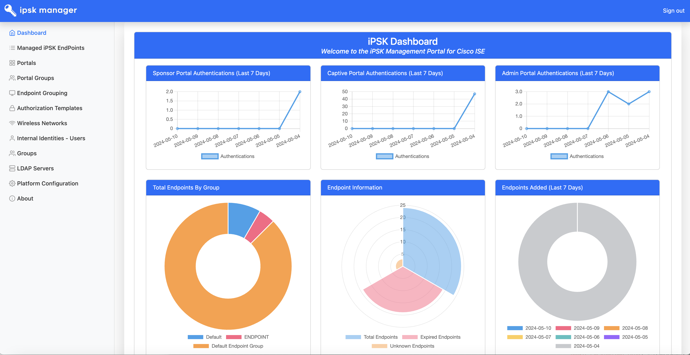

# Identity PSK Manager for Cisco ISE

*Identity Pre-Shared Key(PSK) Manager that simplifies the management and provisioning of unique PSK to devices within your environment.  This is a standalone application which integrates with Cisco ISE through an ODBC Connection and Cisco ISE's APIs.*

---

## Overview

Identity PSK ("IPSK") Manager for Cisco ISE provides a way to manage the full Life Cycle of Pre Shared Keys for supported Hardware/Software through Cisco ISE.  

The sample code provided is designed to integrate with Cisco ISE via ODBC, External RESTful Services (ERS) API, and Monitoring API.  

In addition, both the 'Sponsor' & 'Captive' Portals can be customized.  You can edit the existing templates or create new ones that can be added to the manager.

The ODBC Connection provides the core functionality between IPSK Manager and Cisco ISE, while the API's are for other minor functionality such as performing Change of Authorizations ("CoA") and creation of Authorization Profiles for IPSK Captive Portals.

<center></center>

## Features

Identity PSK Manager enables the following features/functionality:

- ODBC Integration with Cisco ISE as an External Identity Source
- Cisco ISE ERS API Integration
- Cisco ISE Monitoring API Integration
- Internal iPSK Identity Store for Management of Administration & Portal Access
- SAML & Active Directory Authenication Capable
- Customizable Authorization Profiles (Unique or Random PSK on a per Device or User basis)
- Customizable Endpoint Groups
- Customizable Portal Groups
- Customizable Sponsor & Captive Portals

**What's New (June 2024)**
- iPSK Manager MySQL Log Table Purge on Admin Portal Login
- SMTP Server Support
- [OpenLDAP Support (Experimental)](#openldap-support-experimental)
- Database Schema Update (v4)

**What's New (May 2024)**
- Refreshed Sponsor Portal Pages
- Refreshed Captive Portal Pages
- [Automated Update Process](#keeping-ipsk-manager-up-to-date)
- Support for running iPSK Manager in a Docker Container 
  - Full container build file and documentation found in external repository [iPSK-Manager-Docker](https://github.com/PubSec-Security-DevNet/iPSK-Manager-Docker)

**What's New (April 2024)**
- [SAML Authentication Support](#saml-authentication-support) (External SP Required)
- Refreshed Admin Portal Pages & Dashboard
- Endpoint Page Filtering Enhancements (Admin and Sponsor Portal)
- [Active Directory Netsted Group Support](#active-directory-nested-group-support)
- LDAP Disable SSL Certificate Verification Option
- Updated Supporting Tool & Framework Versions

## Technologies & Frameworks Used

**Cisco Products:**

- Cisco ISE v2.4+

**Tools & Frameworks:**

- Bootstrap v5.3.3
- jQuery v3.7.1
- feathericon
- Chart JS v4.4.2
- ClipBoard Copy v2.0.11
- DataTables v2.0.5
- PHPMailer v6.9.1

**We would like to thank all the authors & contributers on the previously mentioned Tools & Frameworks!**

The Documentation and Guides available from these tools, contained the details needed to bring this Application to life.  Below are links to references used for the above Tools & Frameworks:
- Bootstrap - Mobile first website Framework [https://getbootstrap.com/docs/5.0/getting-started/introduction/](https://getbootstrap.com/docs/5.0/getting-started/introduction/)
- jQuery - Feature-rich JavaScript Library [https://api.jquery.com/](https://api.jquery.com/)
- feathericon - Simply beautiful open sources icons - [https://feathericons.com/](https://feathericons.com/)
- Chart JS - Simple and Flexible Javascript Charts - [https://www.chartjs.org/docs/latest/](https://www.chartjs.org/docs/latest/)
- ClipBoard Copy - Javascript based copy to clipboard - [https://clipboardjs.com/](https://clipboardjs.com/)

## Prerequisites

- Cisco ISE v2.4+ (Tested with ISE 3.3)
- Apache Web Server
- PHP 8.0+ (Tested with PHP 8.3)
  - Required Modules: **mbstring, ldap, mysqli, mysqlnd, curl, simplexml, xml, sodium, and json**
- MySQL or MariaDB (Tested with MySQL 8.1)

## iPSK Manager Installation

#### Ubuntu 22.04.x LTS

1. After installing Ubuntu OS, make sure the system is up-to-date:
```
admin@ubuntu:~$ sudo apt-get update
admin@ubuntu:~$ sudo apt-get upgrade
```
2. After updating Ubuntu OS, install Apache2, PHP7, MySQL server, and additional modules:
```
admin@ubuntu:~$ sudo apt-get install php apache2 mysql-server php-mysqlnd php-ldap php-curl php-mbstring php-xml
```
3. Enable Apache Modules:
```
admin@ubuntu:~$ sudo a2enmod rewrite
admin@ubuntu:~$ sudo a2enmod ssl
```
4. Download iPSK Manager from GitHub
```
admin@ubuntu:~$ sudo git clone https://github.com/CiscoSE/iPSK-Manager.git /var/www/iPSK-Manager
[sudo] password for admin: 
Cloning into '/var/www/iPSK-Manager'...
remote: Enumerating objects: 13, done.
remote: Counting objects: 100% (13/13), done.
remote: Compressing objects: 100% (13/13), done.
remote: Total 261 (delta 6), reused 0 (delta 0), pack-reused 248
Receiving objects: 100% (261/261), 311.44 KiB | 2.29 MiB/s, done.
Resolving deltas: 100% (141/141), done.
admin@ubuntu:~$ 
```
5. (Recommended) Run post installation script for MySQL
```
admin@ubuntu:~$ sudo mysql_secure_installation utility
```
Note: For more information on the MySQL or MariaDB secure installation utility, please review: 
- [MySQL Secure Installation](https://dev.mysql.com/doc/refman/5.7/en/mysql-secure-installation.html)
- [MariaDB Secure Installation](https://mariadb.com/kb/en/mysql_secure_installation)

6. (Recommended) Instead of using MySQL root account, a temporary 'install' account can be created to install the iPSK Manager then removed once completed
```
admin@ubuntu:~$ sudo mysql -p
Enter password: 
Welcome to the MySQL monitor. Commands end with ; or \g.
Your MySQL connection id is 1080
Server version: 5.7.27-0ubuntu0.18.04.1 (Ubuntu)

Copyright (c) 2000, 2019, Oracle and/or its affiliates. All rights reserved.

Oracle is a registered trademark of Oracle Corporation and/or its
affiliates. Other names may be trademarks of their respective
owners.

Type 'help;' or '\h' for help. Type '\c' to clear the current input statement.

mysql> CREATE USER 'install'@'%' IDENTIFIED BY '{SOME PASSWORD}';
mysql> GRANT ALL PRIVILEGES ON *.* TO 'install'@'%' WITH GRANT OPTION;
mysql> FLUSH PRIVILEGES;
mysql> exit
```
7. Change owner of the iPSK-Manager directory (Showing example of Ubuntu distribution which uses www-data user and group for the apache process)
```
admin@ubuntu:~$ cd /var/www
admin@ubuntu:~$ sudo chown www-data:www-data -R iPSK-Manager
```
8. It is recommended to use SSL for security and subsequent section describes how to enable SSL. However, if no certificate is available,follow the instructions in the Appendix on how to use non-SSL port for the portals

9. (Recommended) Create self-signed certificate using OpenSSL or external tools. You will need private key, signed certificate, and CA chain if applicable

10. (Recommended) Enable SSL for admin portal. There are sample apache configuration files for the admin portal and end user portal located at the root of the install directory called 'portal-ssl.sample.conf' file. There are 3 sections in the file for admin portal and also for enabling port 8443 & 8445 for SSL. You can simply copy each section in to separate files and place them in '/etc/apache2/sites-enabled' to get it enabled. Aside from that you need to make sure to update the path and file names for the certificate. First for admin portal create a file called '443-ssl.conf' with following content: 
```
<IfModule mod_ssl.c>
<VirtualHost *:443>
ServerAdmin webmaster@ipskmanager

DocumentRoot /var/www/iPSK-Manager/adminportal

<Directory /var/www/iPSK-Manager/adminportal>
AllowOverride All
</Directory>

ErrorLog ${APACHE_LOG_DIR}/admin-error.log
CustomLog ${APACHE_LOG_DIR}/admin-access.log combined

# SSL Engine Switch:
# Enable/Disable SSL for this virtual host.
SSLEngine on

# A self-signed (snakeoil) certificate can be created by installing
# the ssl-cert package. See
# /usr/share/doc/apache2/README.Debian.gz for more info.
# If both key and certificate are stored in the same file, only the
# SSLCertificateFile directive is needed.
SSLCertificateFile /path/to/my/ssl.crt
SSLCertificateKeyFile /path/to/my/ssl.key

# Server Certificate Chain:
# Point SSLCertificateChainFile at a file containing the
# concatenation of PEM encoded CA certificates which form the
# certificate chain for the server certificate. Alternatively
# the referenced file can be the same as SSLCertificateFile
# when the CA certificates are directly appended to the server
# certificate for convinience.
SSLCertificateChainFile /path/to/my/ssl.chain

<FilesMatch "\.(cgi|shtml|phtml|php)$">
SSLOptions +StdEnvVars
</FilesMatch>

</VirtualHost>
</IfModule>
```
Note: Make sure to modify the path and file name for the certificate, private key, and the certificate chain

11. (Recommended) Enable SSL for end user portal port. Next for end user portal create a file called '8443-ssl.conf' with following content:
```
<IfModule mod_ssl.c>

Listen 8443

<VirtualHost *:8443>

ServerAdmin webmaster@ipskmanager

DocumentRoot /var/www/iPSK-Manager/portals

<Directory /var/www/iPSK-Manager/portals>
AllowOverride All
</Directory>

ErrorLog ${APACHE_LOG_DIR}/portal-8443-error.log
CustomLog ${APACHE_LOG_DIR}/portal-8443-access.log combined

# SSL Engine Switch:
# Enable/Disable SSL for this virtual host.
SSLEngine on

# A self-signed (snakeoil) certificate can be created by installing
# the ssl-cert package. See
# /usr/share/doc/apache2/README.Debian.gz for more info.
# If both key and certificate are stored in the same file, only the
# SSLCertificateFile directive is needed.
SSLCertificateFile /path/to/my/ssl.crt
SSLCertificateKeyFile /path/to/my/ssl.key

# Server Certificate Chain:
# Point SSLCertificateChainFile at a file containing the
# concatenation of PEM encoded CA certificates which form the
# certificate chain for the server certificate. Alternatively
# the referenced file can be the same as SSLCertificateFile
# when the CA certificates are directly appended to the server
# certificate for convinience.
SSLCertificateChainFile /path/to/my/ssl.chain

<FilesMatch "\.(cgi|shtml|phtml|php)$">
SSLOptions +StdEnvVars
</FilesMatch>

</VirtualHost>
</IfModule>
```

12. (Recommended) Once SSL is enabled restart apache. This time you will be asked to enter password to access the private key file if your private key is encrypted: 
```
admin@ubuntu:~$ sudo systemctl restart apache2
Enter passphrase for SSL/TLS keys for 127.0.1.1:443 (RSA): *********
admin@ubuntu:~$ 
```
13. Run setup via browser. Open web browser from any machine and go to the IP or hostname (If DNS is already setup) of the IPSK Manager host: https://portal.authc.net or https://192.168.201.90/

14. You will be greeted with setup screen, click Next and accept the license agreement page and click Next to continue with setup

15. Installer will also make sure that required PHP modules are installed, if any of the modules are missing go back to the CLI and make sure they are installed and rerun the Installer

16. Accept default values or change values as needed

| Field Name  | 	Sample Entry  |	 Note |
|-------------|-----------------|-------|
|mySQL Server IP/FQDN|	127.0.0.1	 |     |
|iPSK Database Username	| ipsk-db-user  | A random password will be generated at the end of installation process|
|Cisco ISE ODBC Username	| ipsk-ise-user  |	This is the username ISE will use for SQL connection. A random password will be generated at the end of installation process
|iPSK Database Name	| ipsk	|
|MySQL Admin/Root Username	| install	| If using temporary MySQL install account, if not use root account
|MySQL Admin/Root Password	| ******** | If using temporary MySQL install account, if not use root password
 

17. You will also be asked to create local GUI administrator account password

18. If the install fails, please make sure to go through the steps above to see any of the steps were missed

19. At the end of setup process, it will automatically download a txt file called **'DONOTDELETE-iPSKMANAGER-Install.txt'** which contains the database details including username & password needed for ISE communication such as following:
```
#Copyright 2021 Cisco Systems, Inc. or its affiliates
#
#Licensed under the Apache License, Version 2.0 (the "License");
#you may not use this file except in compliance with the License.
#You may obtain a copy of the License at
#
#  http://www.apache.org/licenses/LICENSE-2.0
#
#Unless required by applicable law or agreed to in writing, software
#distributed under the License is distributed on an "AS IS" BASIS,
#WITHOUT WARRANTIES OR CONDITIONS OF ANY KIND, either express or implied.
#See the License for the specific language governing permissions and
#limitations under the License.

########################################################
## iPSK Manager
## DO NOT DELETE THIS DATA - STORE IN A SECURE LOCATION
## THIS FILE CONTAINS DETAILS ABOUT YOUR INSTALLATION
########################################################

#Organization SID for iPSK Manager
#---------------------------------
Organization (System) SID Value = S-1-9-1569991369-1569991369-1

#Encryption Key for Encrypting MySQL Sensitive Data
#--------------------------------------------------
Encryption Key = AipsBSIhIJ+TnwsYkLlw1fTPSXc/siDQoP8YaTWZNpY=

#iPSKManager Database Credentials
#--------------------------------
Host = 127.0.0.1
Username = ipsk-db-user
Password = t@DKrkNyZhvXnUTd
Database = ipsk

#Cisco ISE MySQL Credentials
#---------------------------
Username = ipsk-ise-user
Password = e1YV3JefcDQut8g
Database = ipsk

#Cisco ISE Stored Procedures Names
#---------------------------------
iPSK_AttributeFetch
iPSK_AuthMACPlain
iPSK_FetchGroups
iPSK_FetchPasswordForMAC
iPSK_MACLookup

###OPTIONAL### Cisco ISE Replacement Stored Procedures for returning only Non-Expired Endpoints Contained within the iPSK Database
#---------------------------------------------------------------------------------------------------------------------------------
iPSK_AuthMACPlainNonExpired
iPSK_FetchPasswordForMACNonExpired
iPSK_MACLookupNonExpired
```
_Note: Keep this file safe in case iPSK Manager needs to be restored or new ISE / iPSK Manager integration is needed_

20. You should be redirected to the iPSK Manager login page where you can enter the credential (default GUI admin username is "**administrator**") created during the setup to login to proceed with iPSK Manager configuration

21. Allow SQL connection from other hosts, by editing the '**/etc/mysql/mysql.conf.d/mysqld.cnf**' file. Find the line '**bind-address = 127.0.0.1**' and add '**#**' at the front to remark it. Also, add the following line '**default_authentication_plugin=mysql_native_password**' to enable mysql native passwords so ISE can connect to MySQL 8.x.  

_Note: Please make sure to utilize MySQL security best practices such as firewall rules and limiting MySQL user to specific hosts as above bind address change allows SQL access from all hosts._

22. Restart MySQL service by running "**sudo systemctl restart mysql**"

23. Reset the ISE MySQL credential with mysql_native_password to make it compatibe with ISE

```
admin@ubuntu:~$ sudo mysql -p
mysql> ALTER USER 'ipsk-ise-user'@'%' IDENTIFIED WITH mysql_native_password BY '{PASSWORD}';
mysql> FLUSH PRIVILEGES;
```

24. (Optional) If temporary MySQL account was created in previous step, run the following to remove the 'install' account
```
admin@ubuntu:~$ sudo mysql -p
Enter password: 
Welcome to the MySQL monitor. Commands end with ; or \g.
Your MySQL connection id is 1080
Server version: 5.7.27-0ubuntu0.18.04.1 (Ubuntu)

Copyright (c) 2000, 2019, Oracle and/or its affiliates. All rights reserved.

Oracle is a registered trademark of Oracle Corporation and/or its
affiliates. Other names may be trademarks of their respective
owners.

Type 'help;' or '\h' for help. Type '\c' to clear the current input statement.

mysql> REVOKE ALL PRIVILEGES, GRANT OPTION FROM 'install'@'%';
mysql> FLUSH PRIVILEGES;
mysql> DROP USER 'install'@'%';
```
To configure ISE and WLC for iPSK Manager Click Links Below:

[[ISE Configuration](ISE.md)] [[WLC Configuration](WLC.md)] 

## Appendix
## OpenLDAP Support (Experimental)

***The experimental status is due to the limited testing conducted with an OpenLDAP server. If you plan to use OpenLDAP support, ensure thorough testing within your environment before deploying it in a production setting.***

iPSK Manager now includes the ability to use OpenLDAP as an LDAP directory. However, this feature **requires** the memberof overlay to be enabled on your OpenLDAP server. If the memberof overlay is not already enabled, you will need to activate it. After enabling it, you must either add the memberof attribute to all your users or remove and re-add users to groups to ensure the memberof attribute auto-populates.

### Enabling MemberOf Overlay in OpenLDAP

To enable the `memberof` overlay in OpenLDAP, follow these steps:

1. **Access Your OpenLDAP Server**: Open a terminal and connect to your OpenLDAP server.

2. **Create an LDIF File for the MemberOf Overlay**: Create a file named `memberof.ldif` with the following content:

    ```ldif
    dn: cn=module{0},cn=config
    changetype: modify
    add: olcModuleLoad
    olcModuleLoad: memberof.la

    dn: olcOverlay={0}memberof,olcDatabase={1}mdb,cn=config
    objectClass: olcOverlayConfig
    objectClass: olcMemberOf
    olcOverlay: {0}memberof
    olcMemberOfDangling: ignore
    olcMemberOfRefInt: TRUE
    olcMemberOfGroupOC: groupOfNames
    olcMemberOfMemberAD: member
    olcMemberOfMemberOfAD: memberOf
    ```

    Adjust `olcDatabase={1}mdb` if your database number or type is different (e.g., `{1}hdb` or `{2}mdb`).

3. **Apply the LDIF File**: Use the `ldapadd` command to apply the LDIF file to your OpenLDAP configuration:

    ```sh
    ldapadd -Q -Y EXTERNAL -H ldapi:/// -f memberof.ldif
    ```

4. **Verify the MemberOf Overlay**: Check that the `memberof` overlay is correctly added by running:

    ```sh
    ldapsearch -Q -LLL -Y EXTERNAL -H ldapi:/// -b cn=config '(olcOverlay=memberof)'
    ```

    This command should return the configuration details of the `memberof` overlay.

5. **Update Existing Users**: If you have existing users, you will need to update their `memberOf` attributes. You can either add the `memberOf` attribute manually or re-add users to their respective groups to have this attribute auto-populated.

By following these steps, you will enable the `memberof` overlay on your OpenLDAP server and ensure it works correctly with iPSK Manager.


## Keeping iPSK Manager up to date
#### The automated process documented in this section only applies with versions of iPSK Manager that are installed on your system that have this section in the README.
When there is an update to the Git repository, local iPSK Manager deployment can be updated without reinstallation.  We recomend you periodically update your iPSK Manager deployment so you get all the latest features and fixes.  You can choose to automate the update process by creating a cron job.

To use this upgrade method you need to copy the config.php file from the supportfiles/include directory to someplace outside the iPSK Manager source code.  Automatic restoration of the config.php file will take place after upgrades if the config.php file is placed in the /opt/ipsk-manager directory on your host running iPSK Manager.

1. You should have regular backups of the database, installation directory, and config.php file to restore from if there is a upgrade failure. 
2. Copy the config.php file to /opt/ipsk-manager, you will need to create this directory.  You only need to copy this file once and if you make changes to it.
```
admin@ubuntu:~$ sudo mkdir /opt/ipsk-manager
admin@ubuntu:~$ sudo cp /var/www/iPSK-Manager/supportfiles/include/config.php /opt/ipsk-manager
```
2. Go to iPSK Manager install directory
```
admin@ubuntu:~$ cd /var/www/iPSK-Manager
```
3. Pull repository
```
admin@ubuntu:~$ sudo git pull
```
4. After the repository is pulled open a web browser to the URL of the Admin Portal of iPSK Manager.  The installer script will detect your config.php in the backup directory (/opt/ipsk-manager) and automatically copy it, remove the installation files, and redirect you to the login screen.  At this point your iPSK Manager installation has been updated.

## (Experimental) GUI Logging
Logging via GUI can be enabled by editing the **'additionalmenus.json'** file in **/var/www/iPSK-Manager/supportfiles/adminportals/modules/** directory. Change the "menuEnabled" flag at the end to 1 (default is 0) as shown below and refresh admin GUI and you will see 'System Logging' option visible just below 'About' settings. Note that logging view currently lacks few features to make it useable beyond basic troubleshooting.
```
{"0":{"id":"menuLogging","module":"logging","data-feather":"flag","menuText":"System Logging"},"menuItems":1,"menuEnabled":1}
```
Note: Rest of the logging settings are under Platform Configuration > Advanced Settings and Logging Settings
## Use non-SSL port for admin and end user portal
It is recommended to use SSL for security and main section of the document describes how to enable SSL. However, if no certificate is available, port 80 request to admin portal can be used by creating a file called '80.conf' with following content and placed in '/etc/apache2/sites-enabled' directory: 
```
<VirtualHost *:80>
# The ServerName directive sets the request scheme, hostname and port that
# the server uses to identify itself. This is used when creating
# redirection URLs. In the context of virtual hosts, the ServerName
# specifies what hostname must appear in the request's Host: header to
# match this virtual host. For the default virtual host (this file) this
# value is not decisive as it is used as a last resort host regardless.
# However, you must set it for any further virtual host explicitly.
#ServerName www.example.com

ServerAdmin webmaster@localhost
DocumentRoot /var/www/iPSK-Manager/adminportal

<Directory /var/www/iPSK-Manager/adminportal>
AllowOverride All
</Directory>

# Available loglevels: trace8, ..., trace1, debug, info, notice, warn,
# error, crit, alert, emerg.
# It is also possible to configure the loglevel for particular
# modules, e.g.
#LogLevel info ssl:warn

ErrorLog ${APACHE_LOG_DIR}/error.log
CustomLog ${APACHE_LOG_DIR}/access.log combined

# For most configuration files from conf-available/, which are
# enabled or disabled at a global level, it is possible to
# include a line for only one particular virtual host. For example the
# following line enables the CGI configuration for this host only
# after it has been globally disabled with "a2disconf".
#Include conf-available/serve-cgi-bin.conf

</VirtualHost>
```

Note: May need to remove default config file in the '/etc/apache2/sites-enabled' directory

Next, point port 8080 request to end user portal by creating a file called '8080.conf' with following content and place it in '/etc/apache2/sites-enabled' directory: 

```
Listen 8080

<VirtualHost *:8080>
# The ServerName directive sets the request scheme, hostname and port that
# the server uses to identify itself. This is used when creating
# redirection URLs. In the context of virtual hosts, the ServerName
# specifies what hostname must appear in the request's Host: header to
# match this virtual host. For the default virtual host (this file) this
# value is not decisive as it is used as a last resort host regardless.
# However, you must set it for any further virtual host explicitly.
#ServerName www.example.com

ServerAdmin webmaster@localhost
DocumentRoot /var/www/iPSK-Manager/portals

<Directory /var/www/iPSK-Manager/portals>
AllowOverride All
</Directory>

# Available loglevels: trace8, ..., trace1, debug, info, notice, warn,
# error, crit, alert, emerg.
# It is also possible to configure the loglevel for particular
# modules, e.g.
#LogLevel info ssl:warn

ErrorLog ${APACHE_LOG_DIR}/error.log
CustomLog ${APACHE_LOG_DIR}/access.log combined

# For most configuration files from conf-available/, which are
# enabled or disabled at a global level, it is possible to
# include a line for only one particular virtual host. For example the
# following line enables the CGI configuration for this host only
# after it has been globally disabled with "a2disconf".
#Include conf-available/serve-cgi-bin.conf

</VirtualHost>
```

Note: Within iPSK manager admin portal, go to Portals and make sure the end user portals are configured with port 8080
 
Lastly, restart apache service: 
```
admin@ubuntu:~$ sudo systemctl restart apache2
```
## SAML Authentication Support

SAML authentication is available for authentication in admin, sponsor, and captive portals. iPSK-Manager does not act as a SAML SP and requires an external SP to interact with your SAML IDP (such as the Apache module mod_shib). After successful SAML Authentication, Apache sets either an Apache Environment Variable or a Header. By default, the Header option is disabled, and the Environment Variable used is REMOTE_USER, but it can be changed. Settings for SAML are located in Platform Configuration.

Users authenticated with SAML still need to be in either the internal database or an LDAP database and assigned to groups for Authorization. For internal database users, the password can be set to any value as users will never login with a password. The user store for captive and sponsor portals Authorization is based on the portal configuration. For admin portal Authorization, it defaults to the internal database. To use LDAP Authorization for the admin portal, enable the setting in Platform Settings and choose which LDAP directory to use; only one LDAP directory is supported for admin portal LDAP Authorization.

**NOTE:**
- There is no backdoor login support when SAML is enabled.  If you need to gain access to a system with broken SAML authentication edit the DB manually to disable SAML authentication. 
- Use of headers for SAML authentication verification should be used with caution and protective measures should be made to make sure a user can not inject the header used for SAML authentication.

### Using Shibboleth (mod_shib) as Service Provider (SP) ###
Install mod_shib from Ubuntu package repository.  Note, as of this writing there is a bug where a bogus message about using a Apache 1.3 module will appear in the logs.  This bug is documented at [https://bugs.launchpad.net/ubuntu/+source/shibboleth-sp/+bug/1984194]

```
admin@ubuntu:~$ sudo apt-get install libapache2-mod-shib
```

Configure the Shibboleth SP to your environment based on Shibboleth documentation. The user attribute should only contain the username for iPSK-Manager to work properly with SAML authentication.

The necessary lines of configuration are already present in .htacess files within the iPSK Manager file structure for using the Shibboleth Apache plugin module.  Once the module is enabled in Apache the configuration will become active.  You will still need to enable SAML from within the iPSK Manager Platform Configuration settings an also do any necessary steps to the Apache configuration that are required for SP operation. 

## Active Directory Nested Group Support

Active Directory nested group support can be enabled in the Platform Configuraton menu.  Enabling support will enable it for all portals (admin, captive, and sponsor) as well as all configured LDAP directories in the system.

**NOTE:**
- To support nested groups, the LDAP process goes through each group assigned to a user and searches those groups to see if it is a member of another group. Depending on the number of groups assigned to a user and how many of those groups are nested groups, there could be a noticeable delay in logging in. The use of nested groups should be avoided if possible.

## Authors

- Gary Oppel
- Hosuk Won
- Nick Ciesinski

## License

This project is licensed to you under the terms of the [Apache License, Version 2.0](./LICENSE).

---

Copyright 2024 Cisco Systems, Inc. or its affiliates

Licensed under the Apache License, Version 2.0 (the "License");
you may not use this file except in compliance with the License.
You may obtain a copy of the License at

http://www.apache.org/licenses/LICENSE-2.0

Unless required by applicable law or agreed to in writing, software
distributed under the License is distributed on an "AS IS" BASIS,
WITHOUT WARRANTIES OR CONDITIONS OF ANY KIND, either express or implied.
See the License for the specific language governing permissions and
limitations under the License.
